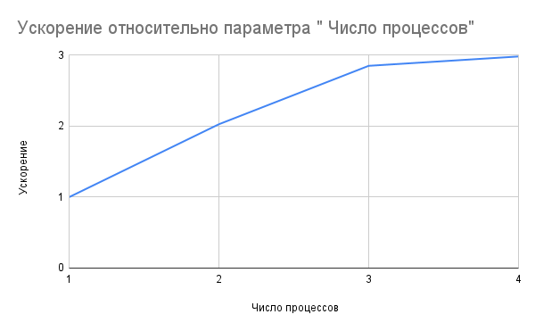
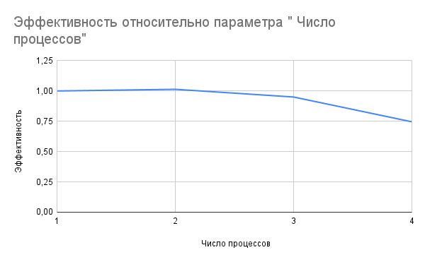
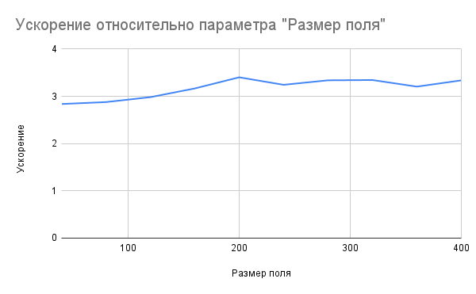
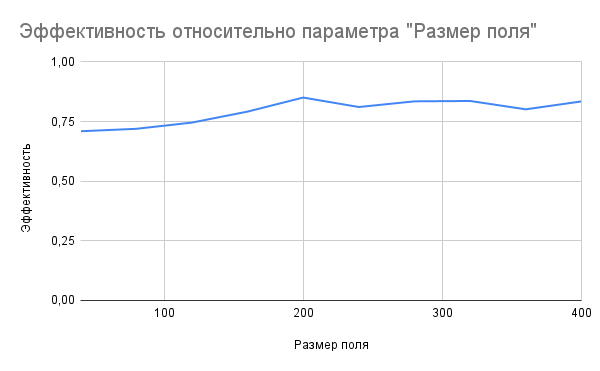

На вход программе подается имя двух файлов - для входных данных и для результата

---

## Формат файла с входными данными
 1. Первая строка - количество шагов
 2. Вторая строка - размер поля (ширина и высота - поле квадратное)
 3. Затем идут строки представляющие поле - `#` означает живую клетку, `.` - мертвую

---

## Принцип работы
 1. Поле делится по горизонтали на равные доли по количеству процессов
 2. Нулевой процесс считывает входные данные и рассылает другим процессам
 3. На каждом шаге:
    1. Каждый процесс (кроме нулевого) посылает свою верхнюю строку наверх
    2. Каждый процесс (кроме последнего) принимает нижнюю строку снизу
    3. Каждый процесс (кроме последнего) посылает свою нижнюю строку вниз
    4. Каждый процесс (кроме нулевого) принимает верхнюю строку сверху
    5. Каждый процесс вычисляет свое новое состояние
 4. Нулевой процесс выводит свой фрагмент в файл с результатом и принимает от остальных процессов их фрагменты, чтобы последовательно вывести в файл

---

## Результаты

| Количество шагов | Размер поля | Число процессов | Время    |
|------------------|-------------|-----------------|----------|
| 1000             | 120         | 1               | 1.06224  |
| 1000             | 120         | 2               | 0.523947 |
| 1000             | 120         | 3               | 0.372624 |
| 1000             | 120         | 4               | 0.356169 |
> Mac OS не позволяет выделить больше 4 процессов

| Количество шагов | Размер поля | Число процессов | Время    |
|------------------|-------------|-----------------|----------|
| 1000             | 40          | 4               | 0.042716 |
| 1000             | 80          | 4               | 0.154241 |
| 1000             | 120         | 4               | 0.356169 |
| 1000             | 160         | 4               | 0.591286 |
| 1000             | 200         | 4               | 0.839866 |
| 1000             | 240         | 4               | 1.26851  |
| 1000             | 280         | 4               | 1.60442  |
| 1000             | 320         | 4               | 2.0917   |
| 1000             | 360         | 4               | 2.78154  |
| 1000             | 400         | 4               | 3.31366  |

| Количество шагов | Размер поля | Число процессов | Время    |
|------------------|-------------|-----------------|----------|
| 1000             | 40          | 1               | 0.1212   |
| 1000             | 80          | 1               | 0.443913 |
| 1000             | 120         | 1               | 1.06224  |
| 1000             | 160         | 1               | 1.8724   |
| 1000             | 200         | 1               | 2.85759  |
| 1000             | 240         | 1               | 4.11464  |
| 1000             | 280         | 1               | 5.35707  |
| 1000             | 320         | 1               | 6.99665  |
| 1000             | 360         | 1               | 8.91553  |
| 1000             | 400         | 1               | 11.0596  |

---

## Графики

---

## Выводы
 1. При повышении числа процессов ускорение увеличивается, но с каждым новым процессом все меньше
 2. При использовании двух процессов эффективность выше, чем при синхронной обработке
 3. При повышении числа процессов эффективность падает
 4. При повышении размера поля ускорение немного увеличивается, но не значительно
 5. При повышении размера поля эффективность немного увеличивается, но не значительно